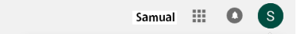

# Vue DP Image
[](//npmjs.com/package/vue-dp-image)


## Introduction

> Create dynamic DP Image that look like the one below with the Vue JS component with just a line of code.



## Code Samples

> It's as simple as have the line of code below:

````
<dp-image :imgsrc="profilePix" alt="Admin DP" :firstname="profileFirstName"  :lastname="profileLastName" :title="profilePixTitle"/>
````

## Installation

> Install from npm with
>````
>npm i vue-dp-image
>````

## Bugs & Sugestions

> If you found any bug or suggestion on this package kindly create an issue here: 
> https://github.com/henryejemuta/vue-dp-image/issues
